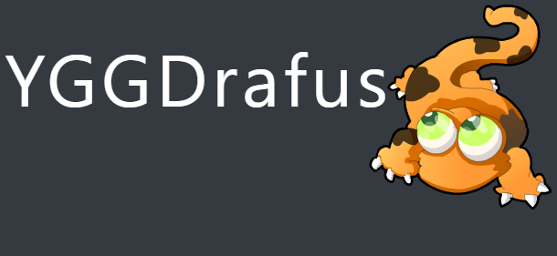

# YGGDrafus

 Custom client based on the official client for the official serveurs Dofus Retro

---

# Table of contents
- **[Changelog](#changelog)**
- **[Instalation](#instalation)**
- **[Usage](#usage)**
- **[Author](#author)**

---

## Changelog
Please see [CHANGELOG](CHANGELOG.md)

---

## Instalation
- **Windows** : Go to **[releases](../../releases/tag/v2.1.6.1)** and download the lastest release then extract it.

- **Mac** : Go to **[releases](../../releases/tag/v2.1.6.1)** and download the lastest release after that go to **[base Mac client](https://drive.google.com/uc?id=10RfU1tkRCqvq8Ny6tQ5gFpkUWtXb4H06&export=download)** download it then extract the two archive you have. Take the content of **`YGGDrafus-VERSION\resources\app\retroclient`** and past it into **`YGGDrafus-base-mac\Dofus.app\Contents\Resources\app\retroclient`**.

---

## Usage
- **Windows** :
  - **64bits** : Go to **`YGGDrafus-VERSION\`** and launch **`Dofus.exe`**.
  - **32bits** : Go to **`YGGDrafus-VERSION\resources\app\retroclient`** and launch **`Dofus.exe`**.
- **Mac** : 
  - **64bits** : Go to **`YGGDrafus-base-mac\`** and launch **`Dofus.app`**.
  - **32bits** : Go to **`YGGDrafus-base-mac\Dofus.app\Contents\Resources\app\retroclient`** and launch **`Dofus.app`**.
 
 ---
 
 ## Author
| **Yggdrasilife** |
| --- |
|  |
|My discord : [Ygg#3562](https://discord.gg/ekxeszm) |
